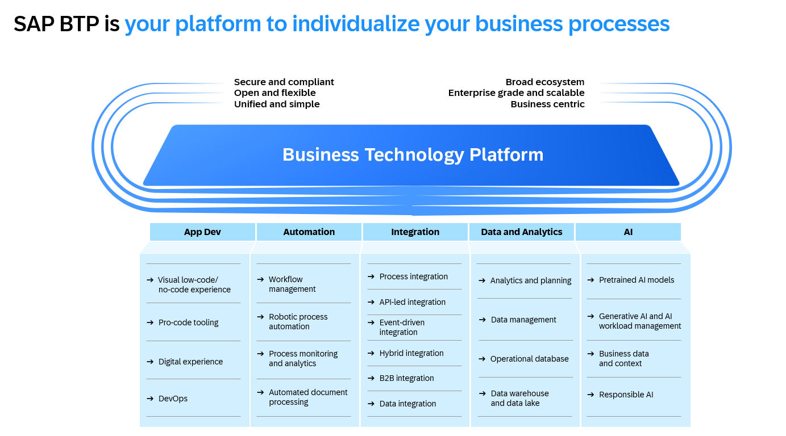
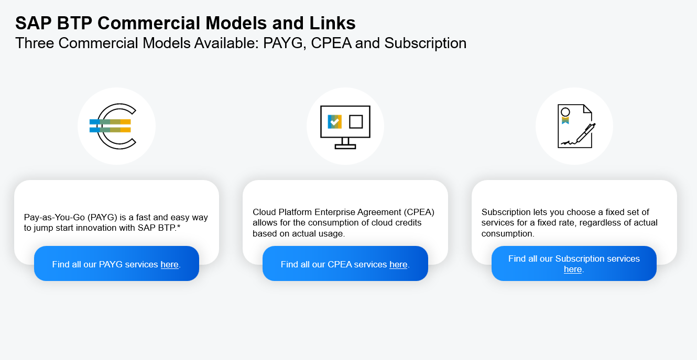
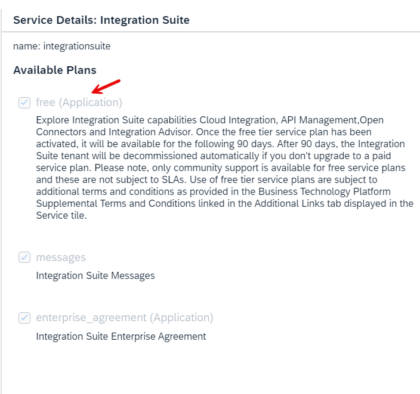
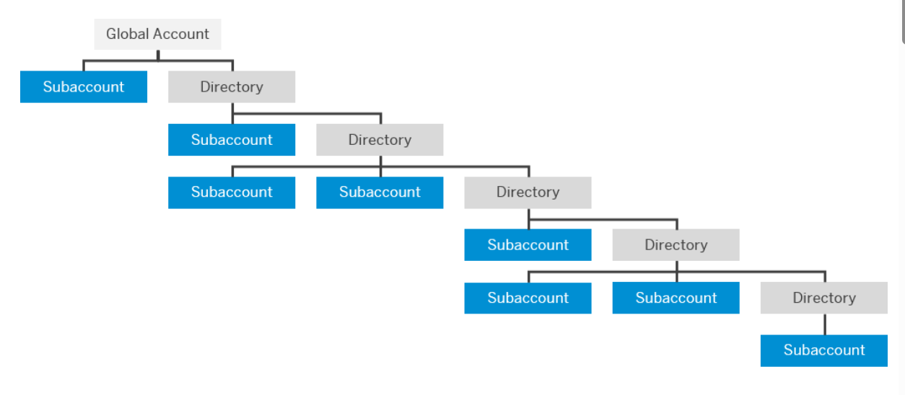
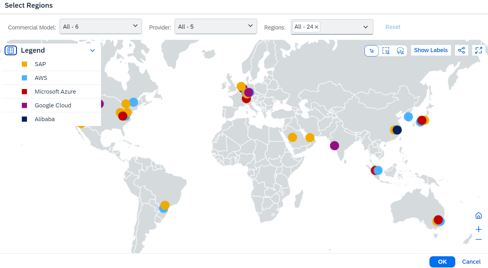
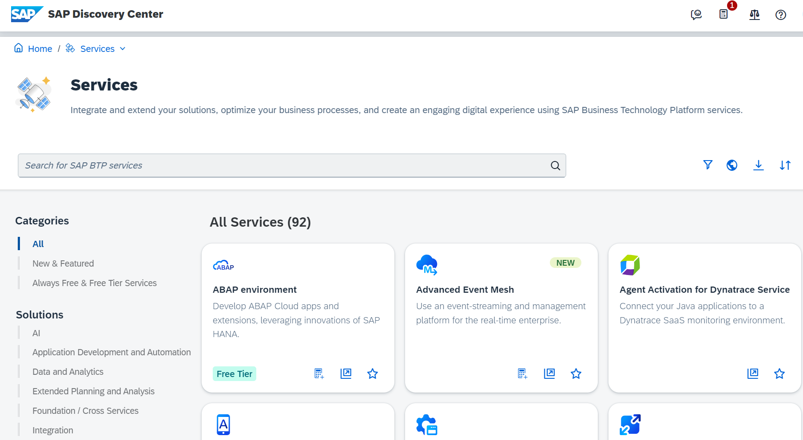
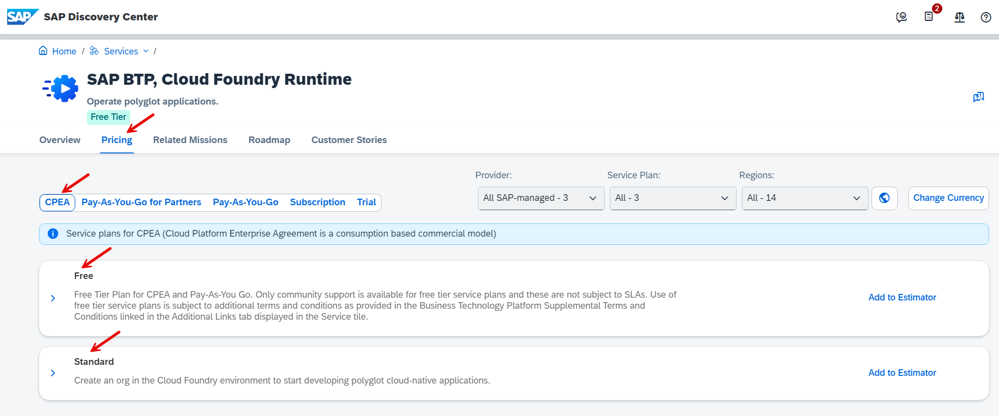

# Get Started with SAP BTP Enterprise Accounts
<!-- description --> Welcome to the mission "Get Started with SAP BTP Enterprise Accounts"! This is the first tutorial of the mission and contains an introduction to SAP BTP. This tutorial explains the basic platform concepts and capabilities of SAP Business Technology Platform (SAP BTP) before you start to configure your BTP Enterprise Account.

## You will learn
  - Introduction to the SAP Business Technology Platform
  - Commercial models to run an Enterprise Account
  - Global Accounts and (regional) Subaccounts
  - Provider and Regions and 
  - Runtime Environments
  - Navigating SAP support

## Intro

The mission "Get Started with SAP BTP Enterprise Accounts" is designed for **global account administrators** and **IT contacts** who received a new SAP BTP **Enterprise Account**. 

This tutorial gives an introduction to the basic concepts of SAP BTP. If you want jump start in the BTP cockpit, proceed to the next tutorial.

### About SAP BTP Enterprise Accounts

SAP BTP provides different types of global accounts, enterprise and trial. The type you choose determines pricing, conditions of use, resources, available services, and hosts.

SAP BTP Enterprise accounts are usually associated with SAP customer or partner contracts and contain their purchased entitlements to platform resources and services. However, it's also possible to create an [enterprise account](https://help.sap.com/docs/btp/sap-business-technology-platform/enterprise-accounts?locale=en-US) for personal exploration.

In case you do not have an Enterprise Account and if you wish to explore or buy an Enterprise Account, you may refer to a [pay-as-you-go license](https://www.sap.com/products/technology-platform/trial.html) and use [Free Tier Service Plans](https://discovery-center.cloud.sap/viewServices?provider=all&regions=all&category=freetierservices). You can learn more about the "Free Tier model" later in this mission.

You can also order a SAP BTP Pay-As-You-Go license in [SAP Store](https://store.sap.com/dcp/en/product/display-9999951781_live_v1/sap-business-technology-platform)

### About SAP BTP Trial Accounts for Single User 

For developers and single users, who want a jump start, we recommend starting on the [SAP Business Technology Platform Trial](https://cockpit.hanatrial.ondemand.com/trial/#/home/trial) page. 

For Trial Accounts follow the tutorial [Get a Free Account on SAP BTP Trial](https://developers.sap.com/tutorials/hcp-create-trial-account.html) in the [SAP Developer Center](https://developers.sap.com/).

For more information, visit [SAP BTP Trial Home](https://cockpit.hanatrial.ondemand.com/trial/#/home/trial)

### Live Webinars about SAP BTP Onboarding 

SAP is conducting monthly webinars to ensure all new customers are aware of how BTP fits into the overall strategy of driving customers towards becoming intelligent sustainable enterprises and the general BTP functionalities.

The [SAP BTP Onboarding Resource Center](https://support.sap.com/en/product/onboarding-resource-center/business-technology-platform.html) page provides access to live webinars, recorded & deep-dive sessions, and a blog series that can help you in your SAP BTP onboarding journey. 

Furthermore, you can also [schedule a 1:1 discussion](https://sapxm.qualtrics.com/jfe/form/SV_2ozSvl0Byxi56Ki) with the SAP BTP Onboarding team or reach them at SAP_BTP_Onboarding@sap.com to ensure a smooth onboarding to Business Technology Platform.

**Note:** The monthly webinars and 1:1 onboarding sessions are free of charge. 

### SAP BTP Uses Cases and Services 

SAP Business Technology Platform Use Cases are real-life use cases, that show how SAP BTP can help meet your specific business needs.
You can explore the SAP BTP use cases on the [SAP home page](https://www.sap.com/products/technology-platform/use-cases.html?sort=title_asc).

SAP BTP capabilities are delivered as services. Before you utilize a service, you need to be familiar with the service plans which are available for this service to select the right one for your scenario. 
You can get more information about the existing service plans of a service in the [SAP Discovery Center](https://discovery-center.cloud.sap/serviceCatalog?showFilters=true).

 <!-- border -->

#### Further information about SAP BTP

* Visit the [SAP Business Technology Platform](https://www.sap.com/products/technology-platform.html) Home Page

* SAP BTP on SAP Help Portal:
    - SAP Help - SAP BTP home page [link](https://help.sap.com/docs/BTP/65de2977205c403bbc107264b8eccf4b/144e1733d0d64d58a7176e817fa6aeb3.html?locale=en-US)
    - SAP Help - SAP BTP Getting Started [link](https://help.sap.com/docs/BTP/65de2977205c403bbc107264b8eccf4b/144e1733d0d64d58a7176e817fa6aeb3.html?locale=en-US)
    - SAP Help - Best Practices for SAP BTP [link](https://help.sap.com/docs/BTP/df50977d8bfa4c9a8a063ddb37113c43/9f2bb927464e4d1ba3d13b2d79ca9bd1.html?locale=en-US)

* SAP BTP on SAP Community:
    - SAP BTP Blogs [all BTP blogs](https://blogs.sap.com/tags/8077228b-f0b1-4176-ad1b-61a78d61a847/)
    - SAP BTP [Questions](https://answers.sap.com/tags/8077228b-f0b1-4176-ad1b-61a78d61a847)
    - SAP Developers [Tutorial Navigator ](https://developers.sap.com/tutorial-navigator.html)

### Commercial Models for Enterprise Accounts

BTP offers two different commercial models for BTP enterprise accounts: 

* Consumption-based commercial model in the flavors Cloud Platform Enterprise Agreement (CPEA) and Pay-As-You-Go (PAYG)
  
* Subscription-based commercial model. 

Some services are **Always Free**, which indicates the service is offering a service plan that comes free of additional charges, as it is already included in your overall SAP BTP contract. 

The consumption-based models Pay-As-You-Go (PAYG) and Cloud Platform Enterprise Agreement (CPEA) offer, in addition, **Free Tier Service Plans** for specific services. 

Free Tier Service Plans provide you an easy way to trial certain SAP services within your enterprise account, free of charge to see if they can meet your needs.

 <!-- border -->

#### Consumption-based commercial model 

Your organization receives access to all current and future services that are eligible for this model. You have complete flexibility to turn services on and off and to switch between services as your business requires throughout the duration of your contract. 

**Pay-As-You-Go for SAP BTP (PAYG)**

With PAYG you can start using cloud services in your production environment with no upfront cost, no minimum usage requirements, and no financial commitments. 
Contract auto-renews every three months with monthly billing. 
It can be upgraded to a Cloud Platform Enterprise Agreement (CPEA).

If you want to try out an SAP pay-as-you-go account with free tier service plans, you can sign up at [SAP Store](https://store.sap.com/dcp/en/product/display-9999951781_live_v1) or follow the tutorial [Set Up an SAP BTP Account for Tutorials](https://developers.sap.com/group.btp-setup.html).

**Cloud Platform Enterprise Agreement (CPEA)**

Your organization makes a prepaid investment in cloud credits for the contract duration with an annual commitment to consume SAP BTP services.

This model is suitable for customers that have well-established and planned use cases, and who want the flexibility of turning services on and off, and switching between services, without the commitment of being tied to a single service throughout the duration of the contract.

This model has a minimum investment entry, and volume-based discounts are available. Please reach out to your SAP sales representative for more information. 

 

#### Subscription-based commercial model

Your organization subscribes only to the services that you plan to use. You can then use these services at a fixed cost, irrespective of consumption.

The entitled cloud services can be used up to the limit of your purchased subscription. 
To use more, you can increase your license volume.
You can optimize your cost by knowing exactly what you need, getting discounts, and benefiting from budget security throughout the contract period.

You can add new services or modify your contract by contacting your SAP sales representative or visiting the SAP Store. 

 

#### Trial

You can also get a free single-user SAP BTP trial license in case you have no access to BTP. 
This gives you access to our community and all the technical resources, tutorials, or blogs you need. 
Visit the [SAP Developer Center](https://developers.sap.com/) or the [BTP Trial cockpit](https://account.hanatrial.ondemand.com/trial/#/home/trial).

### Learn about the Free Tier model

This is one of the most important topics and we request your attention while activating/using your free tier services.

Free tier services are only available on consumption licenses i.e. PAYG or CPEA. As a customer, if you have opted for any of the license models you are eligible to use the free tier and the options show up in your BTP global account.

Free tier services allow you to try out a growing selection of SAP BTP services without being charged up to specified limits for each service. 
For more information about the free tier service plans and their capacity limits, see [Discovery Center](https://discovery-center.cloud.sap/viewServices?category=freetierservices&regions=all&provider=all) Free Tier Services .

 

#### Important!

> **Note:** We have seen situations where customers activate resources in an Enterprise Account unplanned which may end up consuming all the CPEA credits or unexpected bills in case of PAYG.  

> **Note:** Not all services are available with a free service plan and not all free service plans are available in all regions and with all providers.  

> Be careful while you activate services with all the scenarios. Do not activate any services in Enterprise Accounts if you **strictly want to avoid costs** for the services and you are not sure if the service and its service plan is free. In this scenario, consider to use BTP Trial Account first, to become familiar with BTP service configuration.

 

#### Get started with free tier service options:

If you are the global administrator or getting your services activated, it is important to understand the entitlements, with PAYG and CPEA license model your company has access to all the 90+ BTP services without restrictions. 
This unlimited access can help you to spin up all the services as required for your projects.

Let us take a look at service assignments from a Global Account. 
Every service listed in the BTP has its charges which are known as “ service plan” and “quota” to understand the number of units and their usage. 
Taking an example, the image below details some of the free services and a few that are not included as free tiers.

 <!-- border -->

With the Integration Suite, we see that the free tier is applicable and we can also see that the assigned quota is 1 which is already consumed by one subaccount. 

In case the user tries to assign the free tier services to more than one subaccount, a clear message is displayed which indicates that the free service is already in use as shown below.

 <!-- border -->

If you activate the integration suite services with enterprise_agreement or messages, you will be charged based on the pricing details listed in the [Discovery Center](https://discovery-center.cloud.sap/serviceCatalog/integration-suite?region=all&tab=service_plan).

### SAP BTP Global Account

Accounts are structured according to global accounts, subaccounts, and directories.

An global (enterprise) account is the realization of a contract you made with SAP. Global accounts are region- and environment-independent. After successful first login, you will land on your global account home page.

- A global account is either of the account type **enterprise** or **trial** (a limited single-user account).

- A global account is used to manage **global account members** (typically for managing the global account), **entitlements** and regional **subaccounts.**

- A global account can contain one or more subaccounts in which you run applications and services.

   <!-- border -->

For further information, see [SAP Help - Account Model](https://help.sap.com/docs/btp/sap-business-technology-platform/account-model?locale=en-US).

#### Entitlements of your Global Account

When you purchase an enterprise account, you’re [entitled](https://help.sap.com/docs/btp/sap-business-technology-platform/entitlements-and-quotas?locale=en-US) to use a specific set of resources, such as the amount of memory that can be allocated to your applications. 

The amount of resources you may consume are defined in the **Service Plans** of a BTP service. For example, [SAP BTP, Cloud Foundry Runtime](https://discovery-center.cloud.sap/serviceCatalog/cloud-foundry-runtime?region=all&tab=service_plan) offers in the commercial model CPEA the service plan "**Free**" with the limited resource of 4 GB memory to consume. The service plan "**Standard**" let you choose the amount of memory you want to consume.

Entitlements are purchased and managed at global account level, from where they’re distributed to subaccounts, which consume them.

Some BTP services need an explicit **"Quota"** for a subaccount, means a certain amount of the available entitlement is distributed to a specific subaccount.
When you remove quotas from a subaccount, they become available again at the global account level and can be assigned to other subaccounts.

  

### SAP BTP Subaccounts

A global account can contain one or more subaccounts in which you deploy applications, use services, and manage your subscriptions. Subaccounts in a global account are independent from each other.

The entitlements and quotas that have been purchased for a global account have to be assigned to the individual subaccounts.

Each subaccount is associated with one **region** and one **provider** running in that region. Each region represents a geographical location (for example, Europe, US East) where applications, data, or services are hosted.

Regions are provided either by SAP or by our Infrastructure-as-a-Service (IaaS) partners Amazon Web Services (AWS), Microsoft Azure, Google Cloud, and Alibaba Cloud. The third-party region providers operate the infrastructure layer of the regions, whereas SAP operates the platform layer and Cloud Foundry.

For each subaccount, you select exactly one region (that is one data center) and one provider.

For an overview of all available regions, see [Discovery Center](https://discovery-center.cloud.sap/viewServices?provider=all&regions=all&showFilters=true).

Click the small world icon in the filter bar.

 <!-- border -->

As a result, you will see an overview map for Regions and Providers.

 <!-- border -->

### Environments

[Environments](https://help.sap.com/docs/BTP/65de2977205c403bbc107264b8eccf4b/15547f7e7ecd47ee9fa052b0e18c7b0a.html?locale=en-US) constitute the actual platform-as-a-service offering of SAP BTP that allows for the development and administration of business applications.

Infrastructure Provider such as AWS, Azure, GCP or Alibaba Cloud provide the [Multi-Cloud Foundation](https://help.sap.com/docs/BTP/b017fc4f944e4eb5b31501b3d1b6a1f0/06b6fb3d45d040429e36f0359d2fe1f2.html?locale=en-US) which comprises three different environments:

- Cloud Foundry environment, the Platform-as-a-Service (PaaS) technology for many BTP services 
- Kyma environment, a Kubernetes runtime to build cloud-native Kubernetes-based extensions 
- ABAP environment

SAP data center provide the NEO Environment with a limited set of services.

To actually use an environment in a subaccount, you need to enable it by creating an instance of that environment, which will be explained later in the mission. 

**Note:** Not all Services and Applications or Environments are available in all Regions and on all Providers. Different Providers, Environments and Regions may have a different set of available services.

 

### SAP Discovery Center Service Catalog

Available SAP BTP services are listed in the [Discovery Center Service Catalog](https://discovery-center.cloud.sap/serviceCatalog?provider=all&regions=all&showFilters=true). 

 <!-- border -->

If you select a service you can find under the tab **Pricing** information about

- the available commercial models for each service
- Service Plans for the commercial model and if e.g. free tier services plans are available or not
- Regions (data centers locations) and provider where you can provision them and
- the Metric how the consumption of the service is measured

 <!-- border -->

### SAP Discovery Center Cost Estimator

Important to note, you also have an option to add all the services to the [estimator tool](https://discovery-center.cloud.sap/estimator/?commercialModel=cpea) to get a glimpse of the overall charges of the services that you may use for your projects. 
The charges/prices are applicable for every service that is activated in your global account/subaccounts.

You can access the Cost Estimator with the small calculator icon in SAP Discovery Center top-level bar.

