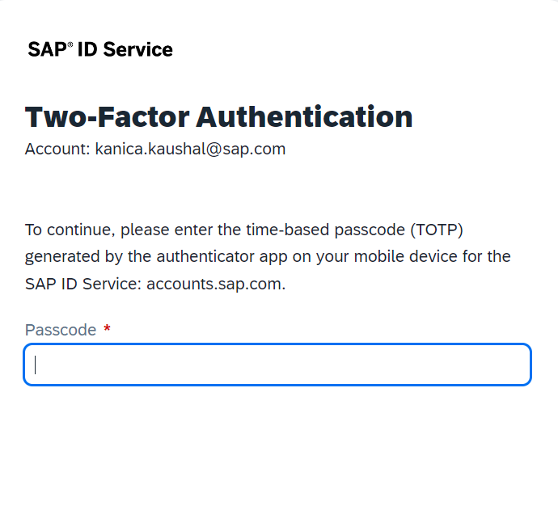
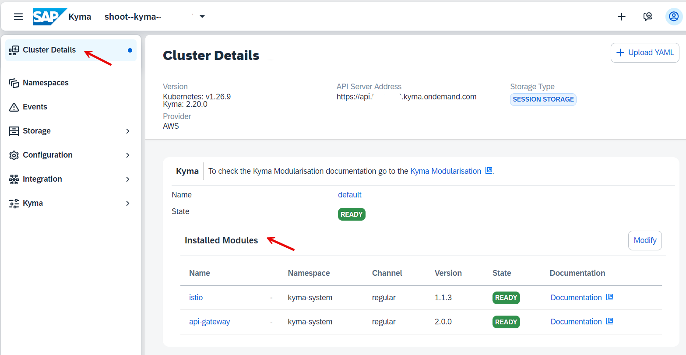
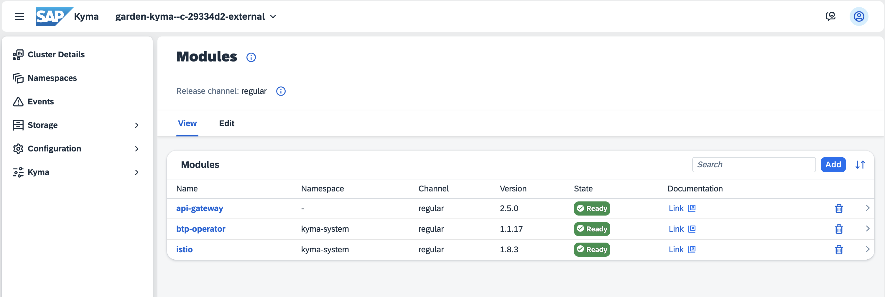
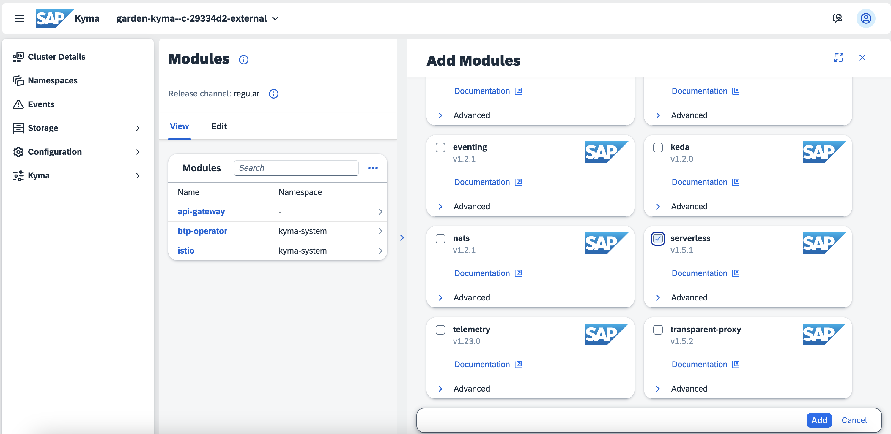
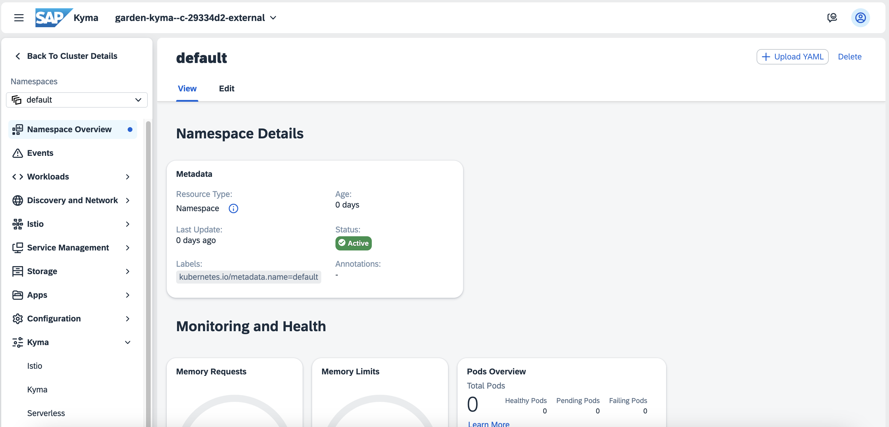
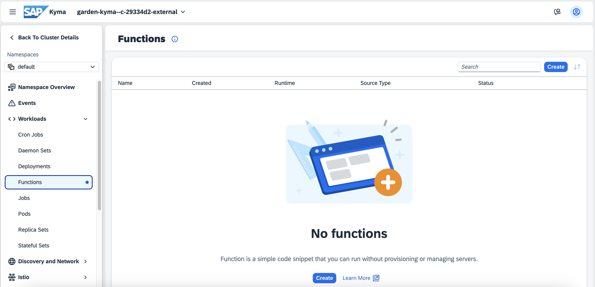

# Add the "Serverless" module to your Kyma environment

<!-- description -->Once the SAP BTP, Kyma Runtime is entitled and enabled it's time to enable the Kyma module "Serverless", so you can start creating your first function and microservice in Kyma.

In this tutorial, you will use Kyma dashboard to add the Serverless module.

## You will learn

  - How to enter Kyma dashboard
  - How to add "Serverless" Kyma module

## Prerequisites

You have created and set up your "SAP BTP, Kyma Environment" either manually or by Quick Account Setup.

### Enter Kyma dashboard

1. In your subaccount go to **Services > Instances and Subscriptions**.

2. Scroll down to **Environments** and choose the three dots **...** in the Kyma Environment line. Then, choose **Go to Dashboard**.

3. If you use the pre-configured shared SAP Cloud Identity Services tenant, SAP ID service, as an identity provider in your enterprise or trial account, the Two-Factor Authentication is enabled and will be enforced.

    Go to your authenticator application on your mobile device and add a new account. Once you scan the QR Code, a password to access Kyma will be created. Enter the password in the **Passcode** field.

    

Congratulations, you are in Kyma dashboard!

### Enable the Serverless module

1. In Kyma dashboard choose **Modify Modules**. This view lists your Kyma module.

    

    > **Note:** When you enable Kyma, it is provisioned with the default modules added:
    > - The **Istio** module is a service mesh with Kyma-specific configuration.
    > - The **API Gateway** module provides functionalities that allow you to expose and secure APIs.
    > - Within the **SAP BTP Operator** module, BTP Manager installs the SAP BTP service operator that allows you to consume SAP BTP services from your Kubernetes cluster using Kubernetes-native tools.

2. Choose **Add** to open the **Add Modules** view. Select **serverless** and choose **Add**.

   

    > **NOTE:** In this tutorial you use the Serverless module from the default release channel, namely the regular channel. You can also choose the fast channel. For more information, see [Kyma Release Channels](https://help.sap.com/docs/btp/sap-business-technology-platform/kyma-s-modular-approach?locale=en-US).

3. Once the module's state is `Ready`, go to **Namespaces** and choose the **default** namespace.

    

4. Within the namespace, go to **Workloads > Functions**, the newly created option that comes with the Serverless module.

    

    Congratulations! Now you can create serverless Functions in Kyma.

